# EAE-598-Project
---

### Title: Applying Machine Learning Techniques to Landfalling Atmospheric River Events with and without Mesoscale Frontal Waves.

#### Project Members: Tony Illenden and Hunter Martinez-Buehrer
---
### Dependencies
To run this repository, you will need the following dependencies: 
  - numpy
  - pandas
  - matplotlib
  - scikit-learn
  - jupyter
  - xarray
  - cartopy
  - siphon
  - metpy
  - scipy

For more information on versions, please refer to the [environment.yml](environment.yml) file.

---
### Data 
To run this repository, you will need to do one of the following: 
1. **(Suggested Method)** Download the ERA5 netCDF data and area-averaged CSV data (final_all_events.csv) from this public [OneDrive folder](https://niuits-my.sharepoint.com/:f:/g/personal/z1969782_students_niu_edu/Esruustb6jtEuK4M4geS8doBmiDO0sMuesT3wtBhtge6eA?e=sSzDOt). It also contains a CSV of the highest-performing variable combinations for the Random Forest model (top_50_variable_triplets.csv). If you have difficulties accessing the data, please email Tony (aillenden@niu.edu) or Hunter (hmartinezbuehrer1@niu.edu).

2. Download the data yourself and generate the area-averaged CSV data by running [main.py](https://github.com/anthony-illenden/EAE-598-Project/blob/main/scripts_and_notebooks/scripts/main.py), but be sure to change the data_mode to "download". Fair waring—this process will take a long time to run, which is why the first method is the suggested method. 

---
### Geoscience Problem & Background

Atmospheric rivers (ARs) which are long, narrow bands of water vapor transport that are commonly associated with a low-level jet (LLJ) ahead of a cold front of an extratropical cyclone (ETC) (Zhu and Newell 1998; Ralph and Dettinger 2012; Ralph et al. 2017; Guan and Waliser 2015; Ralph et al. 2018). The existence (or nonexistence) of ARs can greatly impact an area’s hydroclimate (Paltan et al. 2017), especially in areas such as the western U.S. where ARs can produce up to 30% of the region’s total precipitation (Lavers and Villarini 2015). ARs can be beneficial in transporting large amounts of water vapor poleward from the tropics, helping to replenish rivers, lakes, snowpacks, and reservoirs, but can also produce dangerous flooding leading to excessive runoff and landslides (Ralph et al. 2006; Ralph et al. 2012; Nayak and Villarini 2017; Huang et al. 2020).

When ARs form, they are in conjunction with other meso- and synoptic scale features, such as extratropical cyclones, their associated fronts, and consequently, mesoscale frontal waves (MFWs) (Michaelis et al. 2021). MFWs, also known simply as frontal waves or diminutive frontal waves, are the result of instability in a low-level potential-vorticity strip or warm band at a front, with possible finite amplitude triggered by upper-level features (Joly et al. 1997; Parker 1998). MFWs have been shown to directly increase durations of ARs, which can be tied to prolonged AR conditions and precipitation upon making landfall (Ralph et al. 2011; Neiman et al. 2016) and can even develop secondary cyclones via increased cyclogenesis (Martin et al. 2019). Increased hazards associated with the presence of a mesoscale frontal wave highlights the importance of forecasting for them, though studies have shown that the development of MFWs are rare, and their development into secondary cyclones is even more so (Marin et al. 2019).

The creation of MWFs is influenced by two primary processes: shear along an existing frontal zone (i.e., baroclinic and barotropic instability (Joly and Thrope 1990) and latent heat release (Ludwig et al. 2015; Schemm and Sprenger 2015). In the case of the latter, Michaelis et al. (2021) showed that the lack of latent heat release removed or significantly weakened the MFW, and diminished MWF-AR relationships. Though the creation of MFWs are rare and often missed due to the larger modeling of domain, they are hard to forecast even when the processes are present for creation.

With the need for better understanding and identification of MFW, the goal of this project to see if a method of identifying the creation of a MWF can be used using machine learning (ML). The use of machine learning in meteorology has seen an increase over recent years, as Fig. 1 shows (Chase et al. 2022; their Fig. 1), though Chase et al. 2022 also noted that ML models are viewed as “black boxes”, there users may understand the inputs and outputs of the model, but don’t understand the interworking of said model, and may lead to distrust in the model. However, with a growing number of published meteorological studies using ML methods, it is increasingly important for meteorologists to be well versed in ML (Chase et al. 2022).

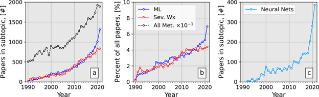
> Figure 1. Search results for the Meteorology and Atmospheric Science category when searching for abstracts for machine learning methods and severe weather.

To look further into helping forecast mesoscale frontal waves, as well as look to better utilize ML, we look to answer the following question, which to our knowledge has not been done in literature
1.	Can we train ML models, such as K-means clustering and a Random Forest classifier, to detect the formation of MWFs using initial conditions present prior to their creation?

Our hypothesis is that a ML learning model, with a great number of defined variables and large training dataset, could be able to predict the formation of MFWs after being trained on detecting their formation, though with a smaller dataset, statistics such as precision, recall, and accuracy will be lower. 

---
### Data & Methods: 

For our dataset, we use the European Center for Medium-Range Weather Forecasts’ (ECMWF) fifth generation model reanalysis, ERA5 (Hersbach et al. 2020). This model reanalysis features a number of useful variables including temperature, moisture, wind speed and direction, and potential vorticity, at the surface and 37 pressure-levels. We will use those variables to calculate additional parameters commonly associated with baroclinic instability, barotropic instability, and latent-heat release, such as equivalent potential temperature, frontogenesis, and shearing and stretching deformation, which are key processes in the development of MFWs in ARs. In total, over 50 variables will be assessed to capture these processes. For a full list of these variables please refer to Table 1.  

<details open>
<summary><strong> Click to Collapse Table 1</strong></summary>

<br>

| **Variable**               | **Description**                                      | **Pressure Level (hPa)**        |
|---------------------------|------------------------------------------------------|----------------------------------|
| `pv`                      | Potential Vorticity                                  | 300, 700, 850, 925, 1000         |
| `z`                       | Geopotential Height                                  | 300, 500, 850, 925, 1000         |
| `t`                       | Temperature                                          | 250, 500, 850, 925, 1000         |
| `q`                       | Specific Humidity                                    | 850, 925, 1000                   |
| `wnd`                     | Wind Speed                                           | 300, 500, 850                    |
| `ivt`                     | Integrated Water Vapor Transport                     | 1000–500                         |
| `thickness_1000_500`      | Thickness                                            | 1000–500                         |
| `qvec_div`                | Q-Vector Divergence                                  | 700–500                          |
| `qvec_magn`               | Q-Vector Magnitude                                   | 700–500                          |
| `abs_vort`                | Absolute Vorticity                                   | 500                              |
| `thetae`                  | Equivalent Potential Temperature                     | 850, 925, 1000                   |
| `fgen`                    | Petterssen’s 2D Kinematic Frontogenesis              | 700, 850, 925, 1000              |
| `tadv`                    | Temperature Advection                                | 500, 850, 925, 1000              |
| `rel_vort`                | Relative Vorticity                                   | 500, 850, 925, 1000              |
| `shearing_deformation`    | Shearing Deformation                                 | 500, 850, 925, 1000              |
| `stretching_deformation`  | Stretching Deformation                               | 500, 850, 925, 1000              |
| `total_deformation`       | Total Deformation                                    | 500, 850, 925, 1000              |
| `t_grad`                  | Temperature Gradient                                 | 850, 925, 1000                   |
| `thetae_grad`             | Equivalent Potential Temperature Gradient            | 850, 925, 1000                   |
| `ivt_grad`                | Integrated Water Vapor Transport Gradient            | 1000–500                         |

</details>

> Table 1. List of variables used in the analysis. 

The analysis focuses on 50 landfalling AR events from a subjective dataset (Table 2), which was generously provided by our colleagues at Portland State University (PSU), and the Coastal Landfalling AR Catalog from the Center for Western Weather and Water Extremes' (CW3E). The PSU dataset covers water years (WY) 2009-2019 and classifies AR events into three categories: Ncyc (no MFW, no secondary cyclone), NDcyc (MFW, no secondary cyclone), and Scyc (MFW, secondary cyclone). The CW3E AR Catalog includes events associated with strong, category 2 ARs between 1 January 1959 and 10 October 2024.  From these datasets, we selected 25 AR-MFW events and 25 AR-noMFW events. We specifically focused on the synoptic and mesoscale characteristics at the location where the MFW formed, approximately one hour prior to its formation, or one hour prior to when an MFW appeared likely to form but did not. For the AR-noMFW events, we selected a location along the cold front, which is where all the frontal waves formed in the 25 AR-MFW events. We then apply a 0.25-degree buffer in both longitude and latitude around the point of interest for each event, creating a larger domain that better represents the surrounding environment than a single point location (Figure 2). Finally, we calculate the mean of all the variables in this larger domain and exported them to a CSV file for machine learning.

<details open>
<summary><strong> Click to Collapse Table 2</strong></summary>
<br>

| **Event Type** | **Date (YYYY-MM-DD)** | **Time (UTC)** | **Lat (°N)** | **Lon (°W)** |
|----------------|------------------------|----------------|--------------|--------------|
| noMFW          | 2005-01-18             | 11:00          | 44.0         | 138.0        |
| MFW            | 2005-03-26             | 09:00          | 35.0         | 138.5        |
| noMFW          | 2008-01-03             | 10:00          | 40.0         | 130.0        |
| noMFW          | 2008-02-23             | 00:00          | 35.0         | 140.0        |
| MFW            | 2006-11-04             | 07:00          | 45.0         | 135.0        |
| MFW            | 2010-01-20             | 06:00          | 38.0         | 130.0        |
| noMFW          | 2010-02-04             | 18:00          | 35.0         | 128.0        |
| noMFW          | 2010-02-26             | 03:00          | 35.0         | 131.0        |
| noMFW          | 2010-03-12             | 00:00          | 40.0         | 132.0        |
| MFW            | 2011-11-22             | 14:00          | 40.0         | 135.0        |
| MFW            | 2012-10-18             | 09:00          | 45.0         | 141.0        |
| noMFW          | 2012-03-09             | 04:00          | 44.0         | 131.0        |
| noMFW          | 2012-11-19             | 19:00          | 41.0         | 129.0        |
| noMFW          | 2013-11-11             | 17:00          | 36.0         | 132.0        |
| noMFW          | 2014-04-16             | 14:00          | 41.0         | 148.0        |
| MFW            | 2014-02-07             | 13:00          | 40.0         | 134.0        |
| noMFW          | 2014-11-03             | 10:00          | 39.0         | 145.0        |
| noMFW          | 2014-11-21             | 08:00          | 42.5         | 140.0        |
| MFW            | 2014-12-10             | 21:00          | 36.0         | 138.0        |
| MFW            | 2015-08-27             | 23:00          | 32.0         | 140.0        |
| MFW            | 2015-11-19             | 02:00          | 45.5         | 131.0        |
| noMFW          | 2015-02-06             | 00:00          | 37.5         | 130.0        |
| noMFW          | 2015-03-25             | 06:00          | 35.0         | 146.0        |
| MFW            | 2016-01-28             | 17:00          | 41.0         | 141.0        |
| noMFW          | 2016-01-17             | 09:00          | 35.0         | 130.0        |
| noMFW          | 2016-11-07             | 11:00          | 36.0         | 138.0        |
| noMFW          | 2016-11-14             | 06:00          | 42.0         | 130.0        |
| MFW            | 2017-02-06             | 02:00          | 26.0         | 156.5        |
| MFW            | 2017-02-20             | 03:00          | 39.5         | 130.0        |
| MFW            | 2017-03-17             | 06:00          | 39.0         | 138.0        |
| noMFW          | 2017-03-28             | 18:00          | 40.0         | 140.0        |
| MFW            | 2017-11-15             | 06:00          | 35.0         | 135.0        |
| MFW            | 2017-11-19             | 03:00          | 38.0         | 142.5        |
| MFW            | 2017-12-28             | 00:00          | 30.0         | 148.0        |
| MFW            | 2018-02-13             | 02:00          | 40.0         | 145.0        |
| noMFW          | 2018-01-23             | 09:00          | 40.0         | 135.0        |
| noMFW          | 2018-11-22             | 11:00          | 40.0         | 132.0        |
| noMFW          | 2019-02-02             | 01:00          | 31.5         | 127.0        |
| MFW            | 2019-02-13             | 17:00          | 34.0         | 131.0        |
| noMFW          | 2020-11-14             | 21:00          | 45.0         | 128.0        |
| noMFW          | 2021-10-24             | 02:00          | 40.0         | 135.0        |
| MFW            | 2021-12-18             | 13:00          | 40.0         | 139.0        |
| noMFW          | 2022-06-10             | 21:00          | 39.0         | 135.0        |
| MFW            | 2022-12-30             | 20:00          | 40.0         | 127.0        |
| MFW            | 2023-01-09             | 12:00          | 31.0         | 130.0        |
| MFW            | 2023-01-14             | 19:00          | 36.0         | 153.5        |
| noMFW          | 2023-07-23             | 06:00          | 45.0         | 150.0        |
| MFW            | 2024-12-28             | 18:00          | 39.0         | 132.0        |

</details>

> Table 2. List of AR events used in the analysis. Events are classified as "MFW" or "noMFW" based on whether a Mesoscale Frontal Wave was detected. 

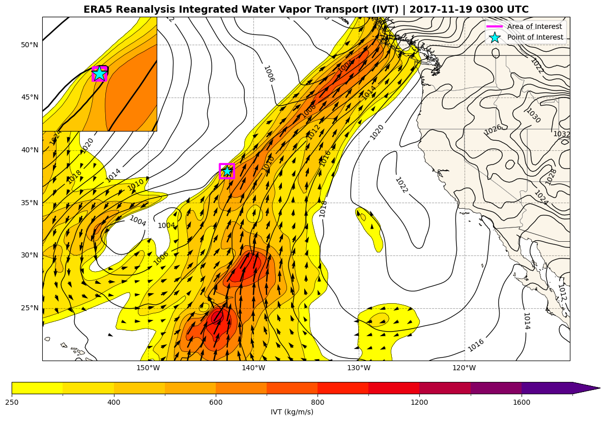
> Figure 2. An IVT plumage map featuring a landfalling AR, with warmer colors indicating higher IVT magnitude, black arrows representing IVT vectors, and solid black contours representing sea level pressure. The blue star represents the IVT cusp where MFW formation is likely, and the magenta box shows the 0.25° buffer place around the IVT cusp to use to calculate the mean of all the variables for the ML model.

We apply K-means clustering to classify AR events (e.g., frontal wave or no frontal wave) based on the underlying synoptic and mesoscale conditions. We use the elbow method and silhouette scores to determine the optimal number of clusters. We then assess the clustering accuracy by comparing the resulting cluster labels with the known event classifications. We repeat this clustering procedure four more times with the following configurations: one, normalize the variables; two, normalize the top 10 most important features; three, use the top 5 most frequent highest-performing Random Forest variables and normalize the data; and four, use the top 15 most frequent highest-performing Random Forest variables and normalize the data. It is important to note that the final two configurations may introduce supervised bias into the clustering, specifically because the Random Forest model is supervised while K-means clustering is unsupervised. Nevertheless, this iterative approach allows us to evaluate how different inputs and strategies may impact the accuracy of K-means clustering. 

To identify the most optimal configuration for the random forest model, we evaluated numerous hyperparameter combinations across three-variable combinations selected from a list of the following features: pv_925, ivt, z_1000, tadv_925, and rel_vort_1000. For each combination, we tested a range of values for the number of trees (n_estimators) from 50 to 1000, maximum depth of trees (max_depth) from 0 to 40, minimum number of samples required to split an internal node (min_samples_split) from 2 to 100, and minimum number of samples to require a leaf node (min_samples_leaf) from 1 to 20. For each configuration, we trained the Random Forest model with the training subset and evaluated it with the validate subset, and measured its performance with basic metrics like accuracy, precision, recall, and F1-score. After looping over all possible combinations, we found that the most common best-performing model configuration featured 100 n_estimators, no max_depth, 2 min_samples_splot, and 1 min_samples_leaf. 

To determine the most effective three-variable combinations for the most accurate Random Forest model, we developed a Python script (rf_model_testing.py) that tested all possible three-variable combinations—totaling over 38,000 unique combinations. For each combination, a Random Forest classifier was trained using the training subset and evaluated with the testing dataset. Similar to the model configuration testing, we measured the performance of the Random Forest classifier using basic metrics such as accuracy, precision, recall, and F1-score. The results were ranked by overall performance, which was derived from a weighted average of the key metrics. The top-50 highest-performing variable combinations, along with their respective performance metrics, were saved to a CSV file for further analysis. 

---
### Results: 
##### Initial Results:
Figure 3 shows the distribution of event typer per water year (October 1st – September 30th) within the PSU dataset. Most of the years within the catalog contained more noMFW events than MFW events, leading to a disproportionate number of the events in the dataset being nonMFW events (Fig. 4). This limitation within the PSU dataset led to us incorporating data from CW3E’s dataset to fill out AR events that contained MFWs. 

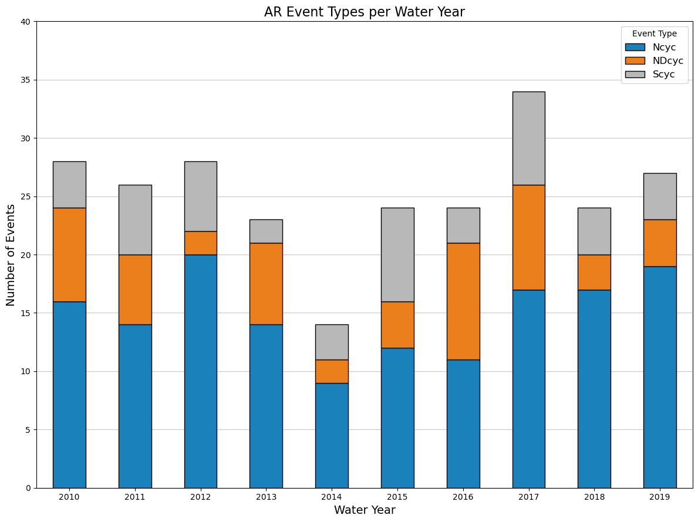
> Figure 3. AR event Types per water year (October 1st – September 30th) within the PSU dataset, with the number of AR events that were Ncyc (no MFW, no secondary cyclone) in blue, the NDcyc (MFW, no secondary cyclone) in orange, and Scyc (MFW, secondary cyclone) in grey.

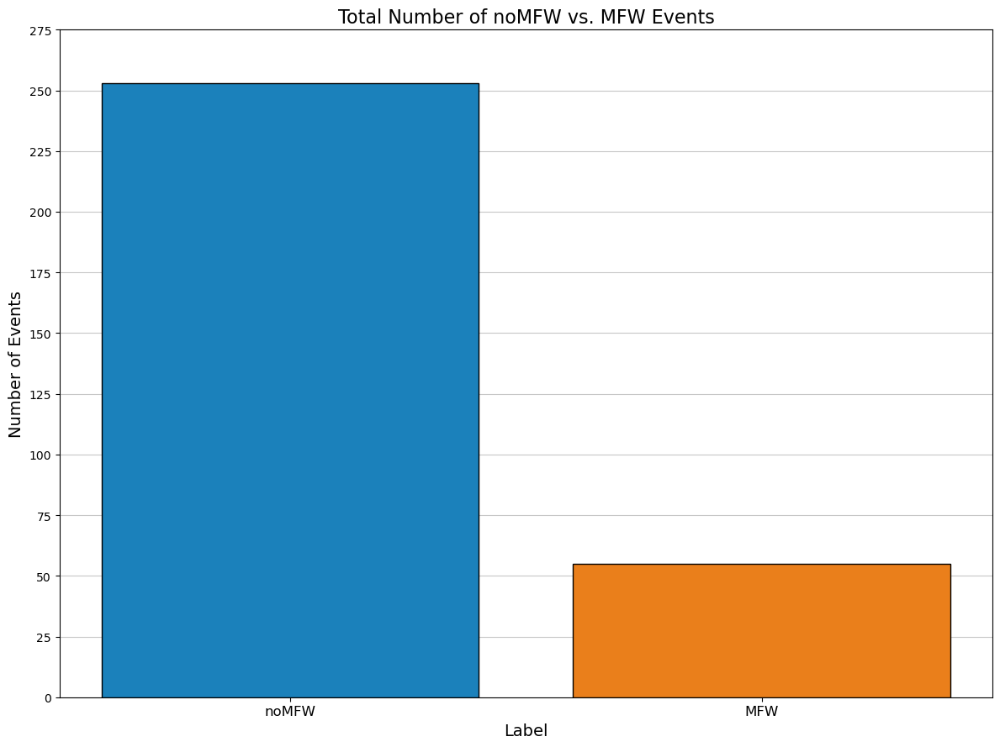
> Figure 4. AR event Types within the PSU dataset, with the number of AR events that had no MFW in blue, and the events with a MFW in orange.

##### Final Results: 
To first analyze the data using k-means clustering, five different variations are used; clustering without scaling, clustering with scaling, clustering with the top variables and scaling, clustering with only the top five variables that were successful in a random forest model, and clustering with the top fifteen variables that were successful in the random forest model. The optimal number of clusters in the data set is determined using the elbow method, and the quality of those clusters compared to the global mean is used using the silhouette method. The first clustering without scaling did not perform well in separating MFWs and noMFWs (Fig. 5).

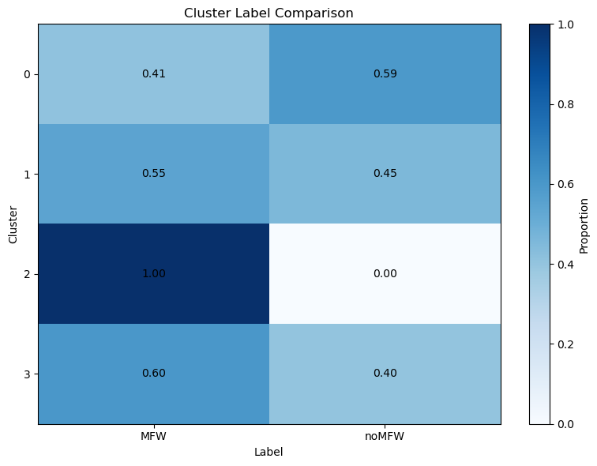
> Figure 5. A comparison of cluster labels between MFWs and noMWFs without scaling. 

When applying scaling to the clusters, the elbow method presented more promise in terms of the number of optimal clusters that can be used, though a much poorer silhouette score showed that clustering configuration is not appropriate with scaling. This is also prevalent when we look at the cluster label comparison for the second cluster (Fig. 6), as there is less uniformity and seperature between MFW and noMWF events between the clusters, which reflects the results found from the silhouette score. 

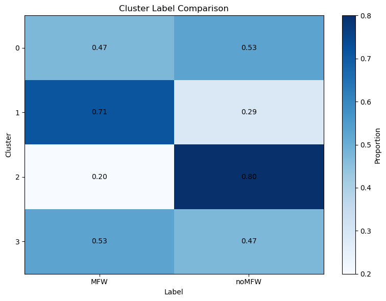
> Figure 6. A comparison of cluster labels between MFWs and noMWFs without scaling. 

The third k-means clustering significantly improved the separation between MFW and noMFW events compared to previous clustering attempts (Figure 7). Cluster 0 was relatively balanced, consisting of 55% MFW and 45% noMFW events across 22 events. Cluster 1 was dominated by noMFW events, with 77% of its 13 events falling into that label. Cluster 2 was very small with a sample size of 3 events but had a 66% noMFW split. Lastly, cluster 3 primarily composed of MFW events, with 75% of its 12 cases labeled as such. 

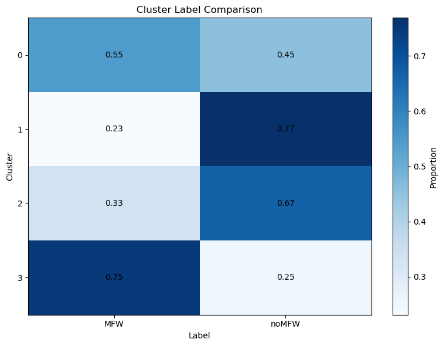
> Figure 7. A comparison of cluster labels between MFWs and noMWFs with scaling using only the top features.

Compared to the global mean, cluster 0 closely followed the mean, though there were a few variables—deformation, frontogenesis, relative vorticity, and mid-/upper-tropospheric wind speeds—that were below the average. Cluster 1 had lower than average temperature advection and stretching deformation, and higher than average shearing deformation, frontogenesis, and mid-/upper-tropospheric wind speeds. Cluster 2 was quite sensitive to its smaller sample size of 3 events exhibited higher than average low-tropospheric shearing and total deformation, frontogenesis, and relative vorticity, and lower than average low-tropospheric temperature advection. Like cluster 0, cluster 3 followed the global mean rather closely, with the exception of low-tropospheric temperature advection, which was higher than normal, and low-tropospheric deformation and frontogenesis, which were lower than normal.  

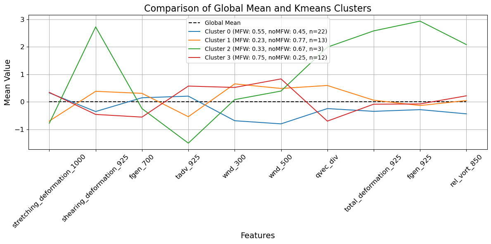
> Figure 8. A comparison of importance features between the global mean and k-means clusters. 

With an idea on what variables may be more important in terms of identifying events (Table 2), the fourth variation of k-means clustering is used only the top 5 variables used in the random forest model, which were: shearing_deformation_925, IVT, total_deformation_850, t_grad_850, and tadv_925. When using these five variables as a basis, elbow and silhouette scores reflected that of the second k-means variation method that utilized scaling, where clusters 0 and 1 were able to differentiate MFW and noMFW events at 57% and 88%, respectively (Figure 9).  Thus, the variation of clustering using only the top 5 variables does not provide a good picture on event type separation, though this may be due to a lack of variables being utilized, leading to our fifth variation of k-means clustering to test that theory.

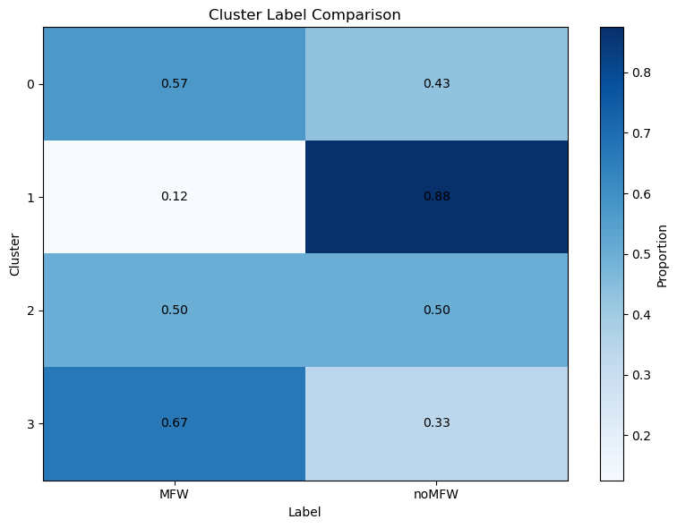
> Figure 9. A comparison of cluster labels between MFWs and noMWFs with scaling using only the top features.

As alluded to previously, the fifth and final variation of k-means clustering used incorporates more variables into the clusters, with this time the top 15 variables used. In addition to the first 5 mentioned previous, the following variables are also taken into account: q_850, z_1000, z_250, tadv_500, pv_300, pv_850, pv_925, pv_1000, and wnd_850. In this variation, more clear clusters are seen than those in the top 5 (Figure 10). In this clustering, clusters 0 and 3 are notably bad at separating MFW and noMFW events, while clusters 1 and 2 are much better. Cluster 1 had 60% MFWs with 15 total events and cluster 2 had 80% noMFWs with 5 total events.

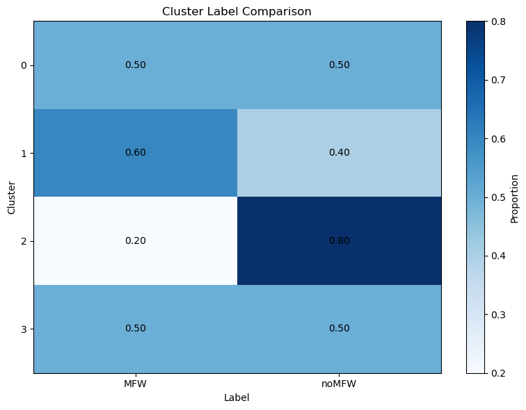
> Figure 10. A comparison of cluster labels between MFWs and noMWFs with scaling using only the top features.

To investigate the synoptic and mesoscale characteristics of the k-means clusters, we compared the fifth clustering—the one with the top-15 highest-performing variables in the Random Forest model—to the global mean for all clusters (Figure 11). Cluster 1 had the highest percentage of MFW events (60%) with the second largest sample size (n=15). The majority of the features in this cluster were approximately the same as the global mean; however, there were some above the global mean and some below the global mean. Those above the global mean feature lower-tropospheric potential vorticity (925-850 hPa), temperature advection (925 hPa), temperature gradient (850 hPa), and geopotential height (1000 hPa). Those below the global mean were upper-tropospheric potential vorticity (300 hPa) and IVT. Cluster 2 had the highest percentage of noMFW events (80%), albeit with the smallest sample size of 5 events. Nonetheless, this cluster notably had higher than average lower-tropospheric deformation (925-850 hPa), temperature advection (925 hPa), temperature gradient (850 hPa), potential vorticity (925-850 hPa), and wind speed (850 hPa). The other clusters were unable to separate MFW and noMFW events, so those were neglected. 

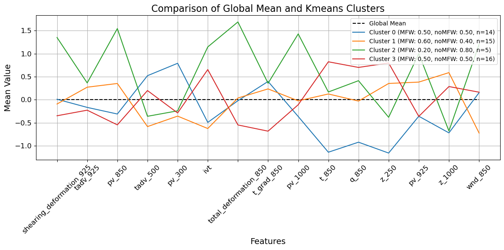
> Figure 11. A comparison of importance features between the global mean and k-means clusters. 

Among the 38,000 unique variable combinations, seven achieved perfect classification performance by the Random Forest model. All of these combinations commonly featured variables such as IVT, low- and upper-tropospheric PV, and low-tropospheric thermodynamic measures, including temperature, temperature advection, and temperature gradient. Several other variable combinations also produced robust performance across all metrics, including those featuring shearing deformation and total deformation, in addition to the previously mentioned variables above. This can be seen in Figure 12, which displays the frequency of these key variables in the highest-performing models. 

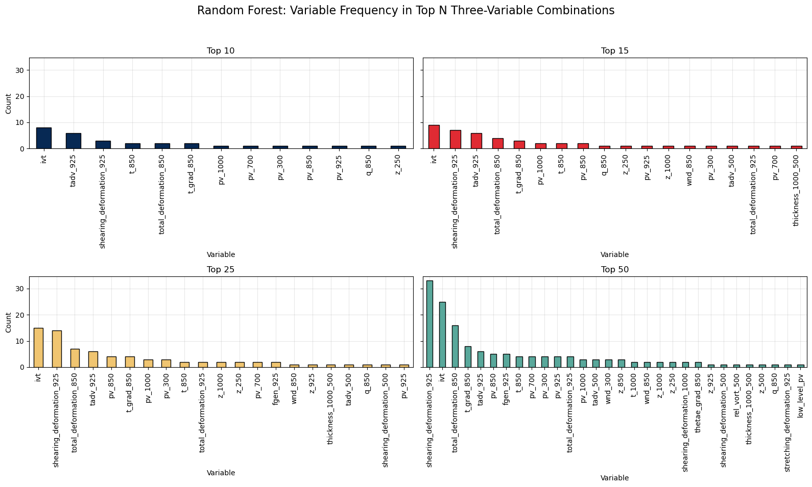
> Figure 12. Frequency of individual variables appearances within three-variable combinations among the top left) top 10 variable combinations, top right) top 15 variable combinations, bottom left) top 25 variable combinations, and bottom right) top 50 variable combinations.

One unique variable combination that yielded a perfect classification performance by the Random Forest model consisted of 850-hPa temperature (t_850), IVT, and 850-hPa temperature gradient (t_grad_850). The decision tree of the Random Forest (Figure 13) revealed that the model first prioritized the 850-hPa temperature, with an initial split of 285.15 K. This was followed by a second split based on IVT, with a threshold of 906.188 kg/m/s. Finally, the last split was the 850-hPa temperature gradient, with a value of 1.976 K / 100 km. 

| Metric       | **Precision** | **Recall** | **F1-Score** | **Support** |
|--------------|---------------|------------|--------------|-------------|
| **MFW**      | 1.00          | 1.00       | 1.00         | 3           |
| **noMFW**    | 1.00          | 1.00       | 1.00         | 7           |
| **Accuracy** |               |            | 1.00         | 10          |
| **Macro Avg**| 1.00          | 1.00       | 1.00         | 10          |
| **Weighted Avg** | 1.00      | 1.00       | 1.00         | 10          |
> Table 3. Random Forest classification report for 850-hPa temperature (t_850), IVT, and 850-hPa temperature gradient (t_grad_850) with a random state of 1895595. For more information refer to rf_model_testing.ipynb. 

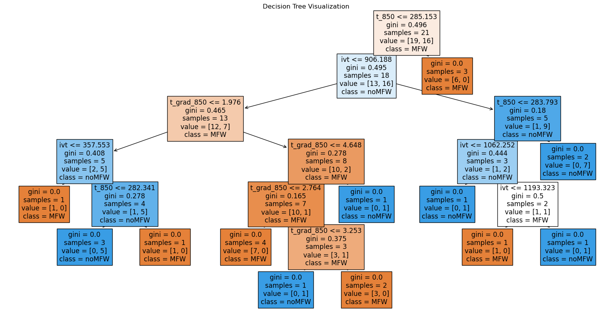
> Figure 13. Decision tree for the Random Forest model using 850-hPa temperature (t_850), IVT, and 850-hPa temperature gradient (t_grad_850).

Partial dependence plots (Figure 14) of these variables demonstrated that 850-hPa temperatures lower than 280 K were associated with a predicted MFW probability of approximately 60-65%, whereas temperatures above 280 K significantly reduced the predicted probability to 25%. IVT values greater than 900 kg/m/s increased the predicted probability to 55-60%, compared to 25-45% for the lower IVT values. For the 850-hPa temperature gradient, the predicted probability peaked at 60% between 1.5 to 2.5 K / 100 km, while values outside this range corresponded to lower predicted probabilities, with some as low as 35%. 

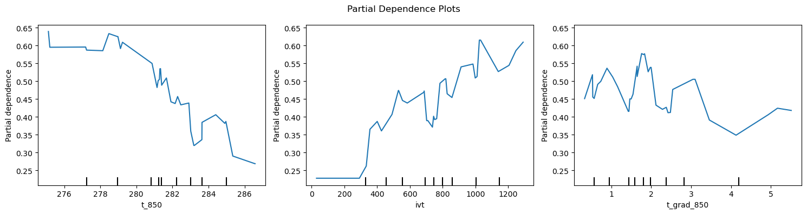
> Figure 14. Partial dependence for the Random Forest model using 850-hPa temperature (t_850), IVT, and 850-hPa temperature gradient (t_grad_850).

---
### Discussion: 
K-means clustering provided some valuable information into the underlying synoptic and mesoscale environments associated with MFW and noMFW events. The third clustering was quite effective at separating these events, with maximum clustering labels of 55%, 77%, 67%, and 75%, respectively. Comparing the importance features to the global mean for each cluster, revealed that the clusters that were predominantly MFWs featured lower than average low-tropospheric deformation and frontogenesis, while those that were mainly noMFWs featured higher than average low-tropospheric deformation and frontogenesis. In other words, frontal wave development may be influenced by low-tropospheric deformation and frontogenesis, where strong low-tropospheric deformation and frontogenesis hinders frontal wave development. This is consistent with the findings from Bishop and Thorpe (1994a, b), who found that the ageostrophic-induced circulation through frontogenesis acts to compress the low-tropospheric potential vorticity strip—the location in which frontal waves tend to form. The results are also consistent with Dacre and Gray (2006), who noted that increased deformation acts to strain the low-tropospheric potential vorticity strip, ultimately hindering the development of frontal waves. The fifth clustering supports this as well—clusters predominantly composed of MFWs had low-tropospheric deformation and frontogenesis near or below the global average, whereas those dominated by noMFWs had values above the global average.  

Among the top-performing variable combinations, the Random Forest model consistently performed the best with variables relevant to MFW development, including lower-tropospheric deformation, potential vorticity, and thermodynamic measures such as temperature, temperature advection, and temperature gradient, as well as IVT. These variables align with the findings from previous studies that highlight the roles of barotropic instability and latent heat release in the formation of MFWs (Bishop and Thorpe 1994a,b; Dacre and Gray 2006; Hewson 2009; Ludwig et al. 2015; Schemm and Sprenger 2015; Martin et al. 2019; Demirdjian et al. 2020; Michaelis et al. 2021). In addition, several baroclinic variables were prominent in top-performing combinations, which we hypothesize that be a result of a few of our MFWs that further developed into secondary cyclones—a process that is driven by baroclinic instability (Dacre and Gray 2006). While future research is needed to test this hypothesis, these results support the idea that MFWs tend to develop within barotropically unstable environments with sufficient latent heat release and may undergo further intensification in the presence of baroclinic instability. 

The partial dependence plots highlight several characteristics associated with AR-MFW events. First, colder 850-hPa temperatures were associated with higher predicted probabilities, suggesting that colder lower-tropospheric conditions are more favorable for frontal wave development than warmer lower-tropospheric conditions. This relationship is somewhat unexpected and contrasts with previous studies that show stronger ARs tend to exhibit warmer lower-tropospheric conditions (e.g., Ralph et al. 2019; Bartlett and Corderia 2021). However, given that MFWs are more likely to occur in stronger AR events, we hypothesize that this observed relationship likely reflects the sampling of the colder side of the AR—the focus of this study—rather than the warmer side located in the warm conveyor. Second, the model’s tendency to assign higher predicted probabilities with increased amounts of IVT matches well with the positive feedback mechanism as outlined in Demirdjian et al. (2020). Lastly, for the 850-hPa temperature gradient, it appears that there may be a Goldilocks zone for the predicted probabilities, where the cold front needs to be strong, but not too strong in order for frontal waves to develop. While we cannot say this with great certainty, the results may suggest that baroclinic instability is less important for frontal wave development than barotropic instability and latent heat release, particularly given the significant decrease in partial dependence with stronger temperature gradients.  

---
### Summary and Conclusion: 
In summary, atmospheric rivers (ARs) are long, narrow synoptic-scale features that transports copious amounts of water vapor from the equator to the poles. While ARs are important to the water cycle for many regions across the western United States, they can also bring significant hazards. Their extreme precipitation rates and long durations often lead to excessive runoff and catastrophic flooding, causing substantial societal and economic impacts. Mesoscale frontal waves (MFWs), also known as diminutive waves, occasionally develop within ARs, enhancing the ascent and moisture transport. Moreover, these waves can significantly modulate the intensity, duration, and landfall location of ARs. Due to the limited understanding of MFWs, predicting their development and subsequent effects on ARs poses a considerable short- and long-term predictability challenge to forecasters. 

In this study, we examine the approximate formation locations of MFWs along cold fronts in 50 landfalling AR events across the western United States, spanning water years 2004-2024. Using ERA5 reanalysis data, we compare AR events with and without MFWs. For the events without MFWs, we analyze regions where MF development appears likely based on synoptic and mesoscale conditions. Key features considered include a secondary IVT maximum upstream of the landfall AR, an IVT cusp, a pronounced low-level equivalent potential temperature gradient, and high low-level potential vorticity (a proxy for latent heating). We apply a couple machine learning techniques—specifically k-means clustering and Random Forest models—to differentiate MFW events from noMFWs events. 

The K-means clustering approach was surpinsigly effectively at separating the AR events based on 62 variables. When comparing the features of indivudal clusters to the global mean across different clusterings, we found that clusters dominated by MFW events exhibited lower than average low-tropospheric deformation and frontogensis, while clusters dominated by noMFWs events exhbitied higher than average deformation and frontogenesis. This was consistent among the third and fifth clustering configurations, and supports the findings from previous studies including Bishop and Thorpe (1994a, b) as well as Dacre and Gray (2006). 

The Random Forest models performed exceptionally well with variables relevant to MFW development like lower-tropospheric deformation, potential vorticity, and thermodynamic measures such as temperature, temperature advection, and temperature gradient, as well as integrated water vapor transport (IVT). These variables are associated with processes such as barotropic instability and latent heat release, which previous studies identify as the primary forcing mechanisms for MFW development—and this project corroborates those findings (Bishop and Thorpe 1994a,b; Dacre and Gray 2006; Hewson 2009; Ludwig et al. 2015; Schemm and Sprenger 2015; Martin et al. 2019; Demirdjian et al. 2020; Michaelis et al. 2021). We also observed several baroclinic instability variables among the highest-performing Random Forest models and believe that is because some of our MFWs further developed into secondary cyclones.  

While this project offers valuable insights, further research is needed to build upon these findings. This includes increasing the number of AR events, incorporating additional variables, and applying more advanced unsupervised techniques, such as self-organizing maps. 

---
### Acknowledgements
First, we would like to thank our advisor, Dr. Allison Michaelis, for their guidance throughout this project and our in-depth discussions about the results. Second, we would like to thank our colleagues, Joe Riedl and Dr. Paul Loikith at Portland State University, who provided us with their subjective AR event dataset. Third, we would like to thank Dr. Jay Corderia at the Center for Western Weather and Water Extremes (CW3E), Scripps Institution of Oceanography, University of San Diego, for their Coastal Landfalling AR Catalog. 

---
### Data Availability
ERA5 reanalysis data was downloaded through the University Corporation for Atmospheric Research’s (UCAR) THREDDS Data Server: https://rda.ucar.edu/datasets/d633000/dataaccess/. Instructions to view and download the specific surface (sfc) and pressure level (pl) datasets used for each event, along with a CSV summary for all events, are listed in the following markdown file in our GitHub repository: https://github.com/anthony-illenden/EAE-598-Project/blob/main/data/data_availability.md. 

---
### References: 
- Bishop, C. H., and A. J. Thorpe, 1994a: Frontal Wave Stability during Moist Deformation Frontogenesis. Part I: Linear Wave Dynamics.
- ——, and ——, 1994b: Frontal Wave Stability during Moist Deformation Frontogenesis. Part II: The Suppression of Nonlinear Wave Development.
- Chase, R. J., D. R. Harrison, A. Burke, G. M. Lackmann, and A. McGovern, 2022: A Machine Learning Tutorial for Operational Meteorology. Part I: Traditional Machine Learning. Wea. Forecasting, 37, 1509–1529, https://doi.org/10.1175/WAF-D-22-0070.1.
- Dacre, H. F., and S. L. Gray, 2006: Life-cycle simulations of shallow frontal waves and the impact of deformation strain. Quarterly Journal of the Royal Meteorological Society, 132, 2171–2190, https://doi.org/10.1256/qj.05.238.
- Demirdjian, R., J. D. Doyle, C. A. Reynolds, J. R. Norris, A. C. Michaelis, and F. M. Ralph, 2020: A Case Study of the Physical Processes Associated with the Atmospheric River Initial-Condition Sensitivity from an Adjoint Model. https://doi.org/10.1175/JAS-D-19-0155.1.
- Guan, B., and D. E. Waliser, 2015: Detection of atmospheric rivers: Evaluation and application of an algorithm for global studies, Journal of Geophysical Research: Atmospheres, 120, 12514–12535, doi:10.1002/2015JD024257.
- Hewson, T. D., 2009: Diminutive Frontal Waves—A Link between Fronts and Cyclones. https://doi.org/10.1175/2008JAS2719.1.
- Huang, X., S. Stevenson, and A. D. Hall, 2020: Future Warming and Intensification of Precipitation Extremes: A "Double Whammy" Leading to Increasing Flood Risk in California. Geophysical Research Letters, 47, e2020GL088679.
- Joly, A., and A. J. Thorpe, 1990: Frontal instability generated by tropospheric potential vorticity anomalies. Quart. J. Roy. Meteor. Soc., 116, 525–560, https://doi.org/10.1002/qj.49711649302.
- Joly, A., et al., 1997: The Fronts and Atlantic Storm-Track Experiment (FASTEX): Scientific objectives and experimental design. Bull. Amer. Meteor. Soc., 78, 1917–1940, https://doi.org/10.1175/1520-0477(1997)078<1917:TFAAST>2.0.CO;2.
- Lavers, D. A., and G. Villarini, 2015: The contribution of atmospheric rivers to precipitation in Europe and the United States. Journal of Hydrology, 522, 382–390, https://doi.org/10.1016/j.jhydrol.2014.12.010.
- Ludwig, P., J. G. Pinto, S. A. Hoepp, A. H. Fink, and S. L. Gray, 2015: Secondary cyclogenesis along an occluded front leading to damaging wind gusts: Windstorm Kyrill, January 2007. Mon. Wea. Rev., 143, 1417–1437, https://doi.org/10.1175/MWR-D-14-00304.1.
- Martin, A. C., F. M. Ralph, A. Wilson, L. DeHaan, and B. Kawzenuk, 2019: Rapid Cyclogenesis from a Mesoscale Frontal Wave on an Atmospheric River: Impacts on Forecast Skill and Predictability during Atmospheric River Landfall. https://doi.org/10.1175/JHM-D-18-0239.1.
- Michaelis, A. C., A. C. Martin, M. A. Fish, C. W. Hecht, and F. M. Ralph, 2021: Modulation of Atmospheric Rivers by Mesoscale Frontal Waves and Latent Heating: Comparison of Two U.S. West Coast Events. https://doi.org/10.1175/MWR-D-20-0364.1.
- Nayak, M. A., and G. Villarini, 2017: A long-term perspective of the hydroclimatological impacts of atmospheric rivers over the central United States. Water Resources, 53, 1144–1166, https://doi.org/10.1002/2016WR019033.
- Neiman, P. J., B. J. Moore, A. B. White, G. A. Wick, J. Aikins, D. L. Jackson, J. R. Spackman, and F. M. Ralph, 2016: An airborne and ground-based study of a long-lived and intense atmospheric river with mesoscale frontal waves impacting California during Calwater-2014. Mon. Wea. Rev., 144, 1115–1144, https://doi.org/10.1175/MWR-D-15-0319.1.
- Paltan, H., D. Waliser, W. H. Lim, B. Guan, D. Yamazaki, R. Pant, and S. Dadson, 2017: Global floods and water availability driven by atmospheric rivers. Geophysical Research Letters, 44, 10387–10395, https://doi.org/10.1002/2017GL074882.
- Parker, D. J., 1998: Secondary frontal waves in the North Atlantic region: A dynamical perspective of current ideas. Quart. J. Roy. Meteor. Soc., 124, 829–856, https://doi.org/10.1002/qj.49712454709.
- Ralph, F. M., and M. D. Dettinger, 2012: Historical and national perspectives on extreme West Coast precipitation associated with atmospheric rivers during December 2010. Bulletin of the American Meteorological Society, 93, 783–790, https://doi.org/10.1175/BAMS-D-11-0188.1.
- Ralph, F. M., et al., 2017: Atmospheric rivers emerge as a global science and applications focus. Bulletin of the American Meteorological Society, 98, 1969–1973, https://doi.org/10.1175/BAMS-D-16-0262.1.
- Ralph, F. M., M. D. Dettinger, M. M. Cairns, T. J. Galarneau, and J. Eylander, 2018: Defining “atmospheric river”: How the glossary of meteorology helped resolve a debate. Bulletin of the American Meteorological Society, 837–839, https://doi.org/10.1175/BAMS-D-17-0157.1.
- Ralph, F. M., P. J. Neiman, G. A. Wick, S. I. Gutman, M. D. Dettinger, D. R. Cayan, and A. B. White, 2006: Flooding on California’s Russian River: The role of atmospheric rivers. Geophysical Research Letters, 33, L13801, https://doi.org/10.1029/2006GL026689.
- Ralph, F. M., P. J. Neiman, G. N. Kiladis, K. Weickmann, and D. W. Reynolds, 2011: A multiscale observational case study of a Pacific atmospheric river exhibiting tropical–extratropical connections and a mesoscale frontal wave. Mon. Wea. Rev., 139, 1169–1189, https://doi.org/10.1175/2010MWR3596.1.
- Schemm, S., and M. Sprenger, 2015: Frontal-wave cyclogenesis in the North Atlantic—A climatological characterisation. Quart. J. Roy. Meteor. Soc., 141, 2989–3005, https://doi.org/10.1002/qj.2584.
- Zhu, Y., and R. Newell, 1998: A proposed algorithm for moisture fluxes from atmospheric rivers. Monthly Weather Review, 126(3), 725–735, https://doi.org/10.1175/1520-0493(1998)126<0725:APAFMF>2.0.CO;2.

---
### Requirements
WX-01 | Identify AR Events with and without MFWs
--------|-----------------
Priority | High
Sprint | 1
Assigned To | Tony
Description | Determine which AR events—with and without MFWs—to use.
Acceptance Criteria | At least 10-20 years of AR-MFW events gathered and cataloged.
Unit Test | N/A

---

WX-02 | Determine Variables within our dataset
--------|-----------------
Priority | High
Sprint | 1
Assigned To | Tony / Hunter
Description | Determine which variables to analyze using ERA5 data, such as integrated water vapor transport, mean sea-level pressure, equivalent potential temperature, frontogenesis, and quasi-geostrophic forcing.
Acceptance Criteria | Get them approved by our advisor, Allison.
Unit Test | N/A

---

WX-03 | Download ERA5 data
--------|-----------------
Priority | High
Sprint | 1
Assigned To | Hunter
Description | Download ERA5 data for surface and pressure level from the ECMWF’s Copernicus Climate Change Service Climate Data Store API or the National Center for Atmospheric Research’s D633000 THREDDS Data Server.
Acceptance Criteria | All files exist. Test a directory to ensure that the surface and pressure-level netCDF files exist for each event. 
Unit Test | See test_files.py or below
```
def test_file_existence(events, data_dir):
    """
    Test if the required files exist in the specified directory.
    
    Parameters
    ----------
    events : list of dict
        List of events with year, month, start_day, and start_hour.
    data_dir : str
        Directory where the files are located.
    
    Returns
    -------
    None
        Asserts if the files do not exist.

    """

    missing_files = []

    for event in events:
        year = event["year"]
        month = f"{event['month']:02d}"
        day = f"{event['start_day']:02d}"
        hour = f"{event['start_hour']:02d}"

        pl_file = f"pl_{year}_{month}_{day}_{hour}.nc"
        sfc_file = f"sfc_{year}_{month}_{day}_{hour}.nc"

        if not os.path.exists(os.path.join(data_dir, pl_file)):
            missing_files.append(pl_file)
        if not os.path.exists(os.path.join(data_dir, sfc_file)):
            missing_files.append(sfc_file)

    assert not missing_files, f"Missing files: {missing_files}"
```

---

WX-04 | Calculate Barotropic Variables
--------|-----------------
Priority | High
Sprint | 1
Assigned To | Tony
Description | Calculate deformation and vorticity variables.
Acceptance Criteria | Use ERA5 variables to calculate these variables. Test the calculation of at least one barotropic-related variable using random values and ensure it has the same lat/lon dimensions. 
Unit Test | See test_calculations.py or below
```
def test_get_total_deformation():
    """
    Function to test the calculation of total deformation.
    
    Parameters
    ----------
    None

    Returns
    -------
    None
        Asserts if the total deformation values are calculated correctly and have the expected dimensions.
    
    """
    mock_data = xr.Dataset(
        {"U": (("latitude", "longitude"), np.random.rand(5, 5)),
         "V": (("latitude", "longitude"), np.random.rand(5, 5))},
        coords={
            "latitude": np.linspace(-90, 90, 5),
            "longitude": np.linspace(0, 360, 5)})

    deformation = get_total_deformation(mock_data)
    assert deformation is not None
    assert deformation.shape == (5, 5)
```

---

WX-05 | Calculate Baroclinic Variables
--------|-----------------
Priority | High
Sprint | 1
Assigned To | Tony
Description | Calculate temperature and moisture gradients in the low- and upper-levels.
Acceptance Criteria | Use ERA5 variables to calculate these variables. Test the calculation of at least one barolinic-related variable using random values and ensure it has the same lat/lon dimensions.
Unit Test | See test_calculations.py or below
```
def test_get_thetae():
    """
    Function to test the calculation of equivalent potential temperature (thetae).
    
    Parameters
    ----------
    None
    
    Returns
    -------
    None
        Asserts if the thetae values are calculated correctly and have the expected dimensions.
    
    """
    mock_data = xr.Dataset(
        {"Q": (("level", "latitude", "longitude"), np.random.rand(37, 5, 5) * 1e-3),
         "T": (("level", "latitude", "longitude"), np.random.rand(37, 5, 5) * 300)},
        coords={
            "level": np.array([1., 2., 3., 5., 7., 10., 20., 30., 50., 70.,
                               100., 125., 150., 175., 200., 225., 250., 300., 350., 400.,
                               450., 500., 550., 600., 650., 700., 750., 775., 800., 825.,
                               850., 875., 900., 925., 950., 975., 1000.]),
            "latitude": np.linspace(-90, 90, 5),
            "longitude": np.linspace(0, 360, 5)})

    level = 925 # units: hPa
    thetae = get_thetae(mock_data, level)
    assert thetae is not None
    assert thetae.shape == (5, 5)
```

---

WX-06 | Extract Potential Vorticity Variables
--------|-----------------
Priority | High
Sprint | 1
Assigned To | Tony
Description | Extract ERA5 Potential Vorticity.
Acceptance Criteria | Extract the ERA5 PV variable. Test the extraction of this variable and ensure it has the same lat/lon dimensions.
Unit Test | See test_calculations.py or below
```
def test_get_pv():
    """
    Function to test the calculation of potential vorticity (PV) at a specific pressure level.

    Parameters
    ----------
    None

    Returns
    -------
    None
        Asserts if the PV values are calculated correctly and have the expected dimensions.

    """
    mock_data = xr.Dataset(
        {"PV": (("level", "latitude", "longitude"), np.random.rand(37, 5, 5) * 1e-6)},
        coords={
            "level": np.array([1., 2., 3., 5., 7., 10., 20., 30., 50., 70.,
                               100., 125., 150., 175., 200., 225., 250., 300., 350., 400.,
                               450., 500., 550., 600., 650., 700., 750., 775., 800., 825.,
                               850., 875., 900., 925., 950., 975., 1000.]),
            "latitude": np.linspace(-90, 90, 5),
            "longitude": np.linspace(0, 360, 5)})

    level = 500  # units: hPa
    pv = get_pv(mock_data, level)
    assert pv is not None
    assert pv.shape == (5, 5)
    assert_almost_equal(pv.values, mock_data["PV"].sel(level=level).values)
```
---

WX-07 | Pre-process ERA5 data
--------|-----------------
Priority | High
Sprint | 2
Assigned To | Tony
Description | Pre-process ERA5 data so that it is ready to be used to train the model.
Acceptance Criteria | Write a script that determines if the data is pre-processed correctly for the model. Ensure that the ERA5 data has the correct dimensions for both surface and pressure level datasets.
Unit Test | See test_datasets.py or below
```
def test_load_local_datasets():
    """
    Function to test the loading of local datasets.
    
    Parameters
    ----------
    None

    Returns
    -------
    None
        Asserts if the datasets are loaded correctly and have the expected dimensions and variables.

    """

    year, month, day, hour = 2025, 4, 14, 0
    data_dir = "C:\\Users\\Tony\\Documents\\GitHub\\EAE-598-Project\\data\\era5"

    ds_pl, ds_sfc = load_local_datasets(year, month, day, hour, data_dir=data_dir)

    expected_dims_pl = {'time': 1, 'level': 37, 'latitude': 141, 'longitude': 201}
    for dim, expected_size in expected_dims_pl.items():
        result = ds_pl.dims[dim]
        assert result == expected_size, f"Pressure level dataset: Expected {dim} size {expected_size}, got {result}"

    expected_levels = np.array([1., 2., 3., 5., 7., 10., 20., 30., 50., 70.,
                                 100., 125., 150., 175., 200., 225., 250., 300., 350., 400.,
                                 450., 500., 550., 600., 650., 700., 750., 775., 800., 825.,
                                 850., 875., 900., 925., 950., 975., 1000.])
    assert 'level' in ds_pl.coords, "Pressure level dataset is missing 'level' coordinate"
    assert len(ds_pl.coords['level']) == 37, f"Expected 37 levels, got {len(ds_pl.coords['level'])}"
    assert np.allclose(ds_pl.coords['level'].values, expected_levels), \
        f"Pressure level dataset levels do not match expected values"

    expected_dims_sfc = {'time': 1, 'latitude': 141, 'longitude': 201}
    for dim, expected_size in expected_dims_sfc.items():
        result = ds_sfc.dims[dim]
        assert result == expected_size, f"Surface dataset: Expected {dim} size {expected_size}, got {result}"

    expected_vars_pl = ['Z', 'T', 'Q', 'V', 'U', 'W', 'PV']
    for var in expected_vars_pl:
        assert var in ds_pl.variables, f"Variable {var} is missing in pressure level dataset"

    expected_vars_sfc = ['mslp', 'u10', 'v10', 't2m', 'd2m']
    for var in expected_vars_sfc:
        assert var in ds_sfc.variables, f"Variable {var} is missing in surface dataset"
```
---

WX-08 | Train AI Model
--------|-----------------
Priority | High
Sprint | 2
Assigned To | Tony / Hunter
Description | Train the AI model with the pre-processed ERA5 data.
Acceptance Criteria | The model can test the given variables and identify synoptic patterns of AR events with and without MFWs.
Unit Test | N/A

---

WX-09 | Post-Process ML data
--------|-----------------
Priority | High
Sprint | 2
Assigned To | Tony / Hunter
Description | Post-process the ML data.
Acceptance Criteria | Model accuracy of 50-60%.
Unit Test | N/A

---

WX-10 | Apply fixes and retrain AI model
--------|-----------------
Priority | High
Sprint | 3
Assigned To | Tony / Hunter
Description | Address any potential issues and retrain the model with those corrections/fixes.
Acceptance Criteria | Same test as first test in the UI.
Unit Test | N/A